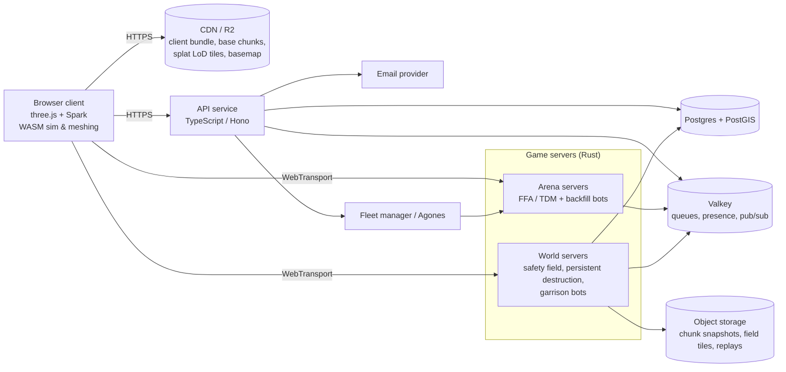

# Turfwar: Game Plan & Tech Stack

*Draft v0.3, 2026-10-09. This is a living document. Items marked **OPEN** need a design decision. Decisions already made are logged in §17.*

---

## 1. The pitch

Turfwar is an always-online, browser-based FPS set on real-world geography: your own hometown. Players sign up with email and join the faction that controls the ground where they actually live. They then fight a persistent war over real city blocks with weapons that permanently reshape the terrain. Next to the persistent world (**The Front**), quick-play **Arenas** (FFA, TDM) are carved out of the same real map. Every faction's territory is garrisoned by its bots, so the world never feels empty.

The launch map is ~1 km² of Glendale, CA, centered on Alexander St (§5.5).

---

## 2. The six decisions that shape everything

1. **What the server simulates is separate from what the player sees.** The server simulates a **voxel world**: collision, destruction, line of sight, bot navigation and spawn finding. The client draws that world as **Gaussian splats** for photoreal surfaces. It adds ordinary **meshes** wherever the world has been damaged. Each splat carries mesh-like attributes: the voxel chunk it belongs to, a material and a normal. That lets splats be cut away, hidden or carried off as debris in step with the voxels. This is how you get Gaussian realism *and* game-grade destruction.
2. **Destruction is stored as an immutable base plus an edit log.** Each piece of the world is generated once from real-world data and never changes. Every explosion appends a tiny edit operation to a log. Clients replay the same operations with the same code. Persistence is cheap, network traffic is tiny, and regeneration is trivial: you expire old operations.
3. **Territory is a living "safety field", not a grid of capture points.** Every faction has a safety value for each 8 m patch of ground. It rises where the faction's people spend time without dying, spreads outward, and is punched down wherever they die. A faction's territory is wherever its field wins. The result is an organic blob that grows and shrinks with the fighting.
4. **One simulation codebase in Rust, compiled twice.** It compiles natively for game servers and to WebAssembly for the browser, so client-side prediction matches the server exactly.
5. **WebTransport (QUIC) carries gameplay traffic.** It sends unreliable datagrams like a native FPS, and reliable streams for everything else. It reached Baseline in all major browsers in March 2026.
6. **Own the real-world data pipeline instead of renting it.** Google and Apple photoreal 3D tiles are off-limits for this game. Their terms forbid caching, extraction, and measuring geometry. Build the world from open data (elevation, OSM buildings, lidar) plus your own or community splat captures.

---

## 3. Scope reality check

This project stacks four hard products:

1. competitive FPS netcode in a browser
2. a persistent MMO world
3. a photoreal real-world content pipeline
4. persistent destruction

Tackling all four at once has sunk well-funded studios. The roadmap (§13) proves each one on its own before combining them. It launches on **one real neighborhood (~1 km² of Glendale)**, not the planet. "Your own hometown" anywhere on Earth is a content-pipeline problem to grow into, not a launch requirement.

---

## 4. Game design

### 4.1 World structure

| Layer | What it is | Server type |
|---|---|---|
| **The Front** | The persistent, always-on war (Command & Conquer). It runs as one or more **worlds** (§4.2) | Long-lived world servers |
| **Arenas** | FFA and TDM matches on a bounded slice of the real map (e.g. "TDM: 400 m around Alexander St") | Short-lived match instances |

### 4.2 Worlds and destruction rules

**The Front runs as worlds**, like MMO realms or survival-game servers. Each world is a complete, persistent copy of the map with its own factions, territory and destruction state. Players pick a world, and faction membership (§4.4) is per world.

Each world's destruction rule is set by the server:

| World type | Destruction |
|---|---|
| **Permanent** | Craters never heal. Contested frontlines turn into crater-filled, smoking hellscapes (§6.6) |
| **Regrowing** | Damage heals over a set half-life (e.g. 6 h or 3 days) |

**Launch with one Permanent world**, because the hellscape is the fun part. Add a Regrowing world once there are enough players to fill two.

**Arenas** set destruction per playlist:

| Playlist | Destruction |
|---|---|
| FFA / TDM "Classic" | Off |
| FFA / TDM "Wrecking" | On; resets when the match ends; regrows over 2–5 min during the match |

Design option: an Arena could *start from* a world's current state at that location, so the persistent war shows up in quick play.

### 4.3 FFA & TDM

These follow the standard formats: 8–16 players for FFA, up to 16v16 for TDM, with a score or time limit. Spawn selection scores candidate points by distance from enemies and line of sight to them. Matchmaking sorts players by region (ping) and skill (OpenSkill or Glicko-2). Bots backfill empty slots.

### 4.4 Factions: your real location decides

- **Joining.** When you first enter a world, the browser asks for your location. You join whichever faction's territory contains that point.
- **Unclaimed ground.** If the point is inside the map but unclaimed, you found a new faction there. **OPEN:** or join the nearest faction within some distance?
- **Splinter factions.** Members of an existing faction can deliberately break away together to form a new faction. This needs a minimum group (e.g. 3+ members of the same faction), and the new faction follows the founding rules in §4.6.
- **Staying put.** Your faction is locked once you join. If you really move house, a relocation is allowed after a long cooldown. **OPEN:** cooldown length.
- **Players outside the map.** At launch the map is 1 km² of Glendale, so almost every player's real location is outside it. **OPEN**, and the most important open question (§16). Recommended for launch: these players are assigned to the faction with the fewest active members. The GPS rule then covers more people as the map grows outward from Glendale.
- **Privacy and cheating.** Precise location is used once and never stored. See §11.

### 4.5 Territory: the safety field

The ground is divided into 8 m × 8 m patches, the same columns as the voxel chunks. Every faction has a **safety** value `S` on every patch. Once a second, the server updates every faction's field:

```
for each faction f, patch p:
  S[f][p] *= decay                                     # fades slowly when nobody from f is around
  S[f][p] += spread * (avg_of_neighbours - S[f][p])    # bleeds outward, which makes organic edges
  S[f][p] += presence_gain   per active human member of f near p
  S[f][p] -= death_penalty   (falling off over radius r) where a member of f dies

owner(p) = the faction with the highest S,
           if that S is above threshold T and leads the runner-up by margin M
           (otherwise the patch is unclaimed)
```

**What this produces**
- Territory is a soft blob. It grows outward from where a faction's people spend time without dying, and it gets eaten away where they keep dying.
- Hold a line and survive, and your border creeps forward. Lose fights, and it recedes.
- An enemy who survives inside your territory builds their own safety there and can eventually overtake yours.
- Where two factions' fields are nearly equal, neither wins by margin `M`. A strip of unclaimed **no-man's-land** appears between them on its own.

**Rules that keep it honest**
- **Only humans move the field.** Bots add no safety, and their deaths don't subtract. Bots do kill intruders, though, and an intruder's death counts against *their* faction. That's how garrisons defend without capturing (§4.7).
- **Only active players count.** A player must be moving and giving input. Each player's contribution is capped, and many members stacked in one spot get diminishing returns, so standing in a corner can't farm territory.
- **Decay is slow.** Use a long half-life (days), so territory is lost mainly by dying rather than by logging off overnight. **OPEN:** exact value.

**Tuning.** The knobs are the decay half-life, spread rate, presence gain, death penalty and its radius, `T` and `M`. Spike S6 (§13) builds a quick 2D simulator with fake players to tune them before the 3D game exists.

**Scale.** The launch region is about 15,600 patches; all of Glendale (~80 km²) would be about 1.2M per faction. The field is stored sparsely, only where `S > 0`, so a 1 Hz update is cheap.

### 4.6 Contested ground, spawning and displacement

- **Contested.** A patch is contested for your faction if one of your members died within radius `r` in the last `N` minutes, or an enemy human is within `r` right now.
- **Spawning.** You can only spawn on patches your faction owns that aren't contested. Spawn points come from the walkability graph (§9), preferring the safest patches (highest `S`) and staying away from recent deaths. If every owned patch is contested, nobody in the faction can spawn until things calm down. That's harsh but dramatic. **OPEN:** whether an HQ or beacon is an exception.
- **Displaced.** A faction that owns no ground is displaced. Its members must re-found it on unclaimed ground at least `D` km from any faction and plant an HQ. A protection window (e.g. 30 min in which deaths there don't count) lets them grow a foothold before fighting their way back. Splinter factions found the same way.
- **Strategic map.** The server publishes the fields as compressed raster tiles every few seconds. The client draws them as textures with a smoothed threshold, so borders look like soft organic shapes that visibly grow and shrink. Recent deaths pulse, contested areas show red hatching, and your squad's positions are marked.

### 4.7 Bots: faction garrisons

- **Every faction's territory is garrisoned by its bots.** Garrison bots are friendly to the owning faction and hostile to everyone else who enters. Unclaimed land has no bots.
- **Bots never capture.** They add no safety, and their deaths subtract nothing. Their kills of intruders still count against the intruders' faction (§4.5).
- **Bots only exist near humans.**
  - Bots spawn in a bubble (~150–300 m) around each human player and despawn when no human is near.
  - Empty borders don't host endless bot-vs-bot wars, and server CPU stays proportional to the number of players.
  - Density follows the territory, within a per-server budget. **OPEN:** denser at borders or in the core?
- **When ground changes hands,** new bots spawn for the new owner. Existing bots keep their side until they die or despawn.
- **Bot weapons do little terrain damage**, so the hellscape is made by players and bots can't crater empty areas. **OPEN.**
- **Labeling.** Bots are labeled as bots on the scoreboard and nameplates.
- **In Arenas,** bots backfill matches to a minimum headcount and leave as humans join.

### 4.8 Accounts
Players sign up by email with a passwordless 6-digit code, then choose a display name. The location prompt comes when they first join a world. Passkeys can be added later.

---

## 5. Real-world map pipeline

### 5.1 Source data

| Need | Source | License notes |
|---|---|---|
| Ground elevation (US) | USGS 3DEP lidar & 1 m DEMs | Public domain |
| Ground elevation (global) | Copernicus GLO-30 DEM | Free, with attribution |
| Building footprints & heights | OpenStreetMap, Overture Maps | ODbL: attribution required, and share-alike applies to derived *databases* |
| Detailed building & tree shape (US) | USGS 3DEP point clouds | Public domain |
| Aerial texture (US) | USDA NAIP | Public domain |
| Photoreal surfaces | Your own captures (ground walk-throughs + drone), and later community phone captures, trained into splats | You own them. Follow drone rules and blur faces and license plates |
| Basemap for the 2D map | OSM via self-hosted Protomaps PMTiles | ODbL |

**Not usable:** Google Photorealistic 3D Tiles and similar services. Their policies prohibit caching or storing the data, extracting it, using it offline, and reading measurements from the 3D geometry. Turning them into collision or destructible geometry would violate those terms.

**Global baseline, then upgrade.** Open data (DEM + OSM) gives a playable, mesh-rendered version of almost anywhere on Earth. Splat captures upgrade an area to photoreal.

**Community capture (later).** Players record a phone or drone walk-through of their block. A server trains it into splats, and after moderation and privacy blurring it becomes that area's photoreal skin. This scales the "your hometown" promise without you capturing the whole world.

### 5.2 Two representations of the same place

```
                    real-world data + captures
                               │
            ┌──────────────────┴───────────────────┐
            ▼                                      ▼
   SIM WORLD (server truth)               VISUAL WORLD (client only)
   sparse voxels, ~25 cm                  Gaussian splats (photoreal skin)
   material per voxel                     + fallback mesh tiles
   collision, destruction, LOS,           + damage meshes (generated live)
   bot navigation, spawn finding          + debris, smoke, scorch
```

**Sim world**
- Voxel size is ~25 cm. Validate this in a spike: 50 cm means 8× less data but chunkier holes.
- A chunk is 32³ voxels, an 8 m cube.
- Each voxel stores a material (1 byte) and a density (1 byte), so surfaces come out smooth rather than blocky.
- A uniform chunk (all air, or all one solid material) is stored as a single value. Most of the world is uniform.
- The ground is solid to ~10 m deep, with indestructible bedrock below that. The map boundary is also indestructible.
- Buildings are hollow shells with floors, generated from the footprint and level count, because real interiors are unknown. Procedural interiors come later.
- Order of magnitude: 1 km² is tens of thousands of non-uniform chunks, a few hundred MB compressed. The server keeps hot chunks in memory, and clients stream the chunks near them.

**Visual world.** Splat tiles in Spark's `.RAD` level-of-detail (LoD) format are streamed from the CDN with HTTP range requests. Mesh tiles built from the voxels serve low-end GPUs and areas with no capture.

### 5.3 Making Gaussians behave like meshes

Plain 3D Gaussian splats are a cloud of fuzzy blobs. They have no surface, no collision, no inside, and their lighting is baked in. The techniques below give them mesh-like properties, and they are used together:

| Technique | What it gives | How Turfwar uses it |
|---|---|---|
| **Surface-aligned splats** (2D Gaussian Splatting, surfel regularization) | Splats lie flat on real surfaces, with true normals and accurate depth | Train captures this way to get clean cuts, plus normals for decals and lighting |
| **Mesh extraction** (2DGS + TSDF fusion, Gaussian Opacity Fields, MILo) | A watertight mesh derived from the splats | Voxelize it into collision that matches what players see, fused with DEM and OSM data |
| **Per-splat attributes** | Chunk ID, building ID, and material class (concrete, glass, wood, foliage) | Destruction deletes exactly the splats in removed voxels. Material drives impact effects and sounds. Labels come from projecting OSM footprints and lifting 2D segmentation to 3D (Gaussian Grouping-style) |
| **Splats bound to geometry** (GaMeS / Gaussian Frosting-style binding) | Splats follow a parent transform | When a wall chunk breaks off as debris, its splats ride the rigid body |
| **Triangle Splatting+ / MeshSplatting** (2025 research) | Opaque triangle meshes trained straight from photos, game-engine-ready with collision and walkable surfaces | If quality holds at city scale, these could replace splats and turn destruction into plain mesh CSG. Worth a spike (§13) |

What splats still can't do well:
- **Interiors.** A capture only sees surfaces. A blast hole reveals voxel material, rendered as a regular PBR mesh: concrete, brick, rebar, dirt. It looks "gamey" next to photoreal surfaces. Players expect that from destruction, so it is acceptable.
- **Lighting.** Light is baked in at capture time. Pick one consistent time of day per region. Estimate the sun direction at capture time so players and meshes are lit to match. Muzzle flashes and explosions become additive tints through Spark's shader graph. A true day/night cycle is a later problem.
- **Weak GPUs.** Splats cost sorting time and overdraw. Ship a mesh-only quality tier.

### 5.4 Coordinates
- **Global:** WGS84 latitude/longitude.
- **Per region:** a local East-North-Up frame in meters, with its origin at the region center. This keeps float32 precision near 1 mm within ±8 km.
- **Addressing:** chunks are `(region, cx, cy, cz)`; territory patches are the `(cx, cy)` chunk columns.
- **Georeferencing:** captures must be georeferenced with GPS plus ground control points so they line up with the voxel world.

### 5.5 Launch region: Glendale, CA

**Center:** Alexander St, Glendale City Center, 91203, at roughly 34.153° N, 118.267° W (the street's midpoint). Start with about 1 km × 1 km around it.

**What's there** (from OpenStreetMap; verify on the ground)

| Feature | Where | What it means for the game |
|---|---|---|
| Ventura Freeway (CA-134) | Runs through the area, just north of Alexander St | A natural frontline: a wide open gap with overpass and underpass chokepoints |
| San Fernando Rd (rail and industrial corridor) | Southwest edge | Warehouses, rail lines and long sightlines: a different combat flavor from the residential blocks |
| Brand Blvd high-rises | ~1.1 km east, just outside a 1 km box | **Option:** stretch the region east to ~1.5 × 1 km to include downtown towers for vertical combat |
| Columbus Elementary School, plus two churches within ~700 m | Inside the region | Treated like every other building: fully destructible |
| **One protected building** | Inside the region | The only exception in the whole map: a single house that can't be destroyed. Worldgen gives its voxels the indestructible material, so blasts only scorch it. Its footprint ID lives in a private worldgen config, not in this doc |

**What the 1 km² box contains** (OSM, 2026-10-09)
- ~17 km of streets and ~6 km of alleys and service roads.
- 1,604 buildings, but only 91 of them have a height or level count in OSM. **Heights must come from lidar.**

**Data**
- **Elevation and lidar:** USGS 3DEP. Spike S2 confirms which lidar tiles cover these blocks and how dense they are.
- **Buildings:** OpenStreetMap footprints, with heights and roof shapes taken from 3DEP lidar. LA County's countywide building outlines also include heights, but the county marks them as LARIAC-members-only, so check the license before using them.
- **Imagery:** NAIP.

**Capture**
- An FPS is mostly seen from street level, so the main capture is on the ground: a gimbal or 360° camera walked along every street. Ground capture needs no airspace approval.
- Drones fill in rooftops and upper facades. The area is about 10 km (~5 nm) from Hollywood Burbank Airport, near the edge of its Class C airspace.
  - Check the FAA UAS Facility Map, and get LAANC authorization if needed.
  - Use a Part 107-certified pilot.
  - Check whether the City of Glendale requires a film or drone permit.
  - Don't fly over people.

### 5.6 Data acquisition: the most coverage for the least money

**Strategy:**
1. Cover everywhere with a free open-data mesh.
2. Make the places people actually fight photoreal, with cheap do-it-yourself capture.
3. Let players capture their own blocks to grow photoreal coverage over time.

| Tier | Coverage | Look | Cost | Used for |
|---|---|---|---|---|
| **0. Open-data mesh** | All of the US at good quality; the rest of the world more roughly | Clean game look: real building shapes and roofs, procedural facades, real roof colors | $0 for data; compute only | Everything not yet captured, the distant skyline, and low-end GPUs |
| **1. DIY photoreal capture** | The launch region, then wherever the fighting is | Photoreal | ~$1.3k–2.3k for the first km², including gear | The places players spend the most time |
| **2. Community capture** | Wherever players live | Photoreal, quality varies | ~$0.50–2 of GPU time per submission | Growing "your hometown" coverage |
| **3. Commercial mobile mapping** (optional) | Whole cities | Photoreal, consistent | Quote-based and high | Only if funded and expanding fast |

#### Tier 0: open-data mesh (everywhere, $0)
- **Ground:** 3DEP 1 m DEM in the US; Copernicus 30 m DEM elsewhere.
- **Buildings:** footprints from OSM and Overture, with heights and roof shapes from 3DEP lidar point clouds.
  - Lidar is essential in Glendale, because OSM has heights for only 6% of buildings.
  - Tools: PDAL processes the lidar. geoflow, the open-source pipeline behind the Netherlands' 3D BAG, reconstructs buildings with real roof shapes from footprints plus lidar.
- **Surfaces:**
  - Roof colors come from NAIP aerial imagery.
  - Facades come from procedural rules keyed on OSM building type and height, using free CC0 PBR materials (ambientCG, Poly Haven).
  - Colors are matched to nearby captures (§5.7).
- **Vegetation:** tree positions, heights and crown sizes come from the lidar's vegetation returns, drawn with instanced tree models.
- **Streets:** sidewalks, curbs and road markings come from OSM.
- **Output:** the same voxel sim world, plus mesh tiles. A whole city builds in hours of compute.
- **Outside the US,** most places have no free lidar. Heights come from OSM tags or defaults, so buildings look plainer.

Because Tier 0 is nearly free, the playable map can grow to all of Glendale or wider whenever needed. Growth is then limited by player density, not data.

#### Tier 1: DIY photoreal capture (the launch region)

**Gear and costs** (rough estimates)

| Item | Cost | Notes |
|---|---|---|
| 360° camera (Insta360 X5 or newer) + a 2–3 m pole | ~$600 | Captures both sides of a street in one pass |
| Rooftop pass: hire a local Part 107 drone pilot for half a day, *or* buy a sub-250 g drone | ~$500–1,200 | DJI has been on the FCC Covered List since Dec 2025. Current models are still sold, but an August 2026 FCC proposal could pull them. Hiring a pilot avoids that risk |
| 2 TB external SSD | ~$100–150 | Raw 360° video for 1 km² is about 1 TB |
| Software | $0 | GLOMAP/COLMAP, RealityScan (free under $1M revenue), gsplat, Brush (Apache 2.0). Postshot is optional (free tier or $199/yr) |
| Cloud GPU for bulk training | ~$100–200 | An RTX 4090 rents for $0.34–0.69/hr on RunPod. Budget ~75 GPU-hours plus re-runs |
| **Total** | **~$1.3k–2.3k** | Plus about a week of capture and processing time |

Your PC (RTX 5060 8 GB, 32 GB RAM) handles spike S1 and single blocks. Rent bigger GPUs for the full region.

**Capture plan for the 1 km² box**
- **Streets.** Walk both sidewalks of every street with the 360° camera held up on a pole above your head. That's ~35 km, or about 10–12 hours of walking: two or three mornings. A faster option is a car-roof mount (about 2 hours of driving), then walking only what a car can't reach.
- **Alleys and plazas** take about 2 more hours.
- **Walk each block as a loop,** so the reconstruction ties together.
- **Lighting is baked in forever.** Shoot on overcast days, or in the same time window every day, so it stays flat and consistent from block to block.
- **Rooftops.** Fly one drone grid pass over the region for rooftops and upper facades, after checking the FAA UAS Facility Map and LAANC (§5.5).
- **Public ground only.** Stay on public sidewalks and streets. Backyards and the backs of buildings come from Tier 0.

**Processing pipeline** (scripted in `tools/splat/`, so every later capture, including community ones, runs the same steps)
1. **Frames.** Extract frames from the 360° video and split each into 6–8 ordinary perspective views.
2. **Privacy.** Blur faces and license plates (e.g. with EgoBlur) before anything is stored long-term.
3. **Transients.** Mask out people and vehicles with a segmentation model so they aren't baked into the world. Parked cars come back later as separate, destructible game props.
4. **Camera poses.** Solve them with GLOMAP (fast) or RealityScan, block by block with overlap.
5. **Georeference.** Align the reconstruction to the 3DEP lidar with ICP plus scale, using the camera's GPS as a starting guess. This means no ground survey is needed.
6. **Train.** Split the region into ~100–150 m blocks with overlap and train each one with gsplat in 2DGS mode, which gives flat, mesh-friendly splats. Trim the overlaps, and remove floaters and sky.
7. **Collision.** Extract meshes from the splats and fuse them into the voxel world. This adds detail Tier 0 misses: curbs, garden walls, fences.
8. **Tag.** Label each splat with its chunk, building and material.
9. **Publish.** Compress, build the LoD (Spark `.RAD`), and upload to R2.

#### Tier 2: community capture (later)
- **Scan your block.** An in-game flow guides players through recording a phone or 360° video: walk a loop, at the right speed. They then upload it.
- **Automatic processing.** The server runs the Tier 1 pipeline on the upload, then checks quality: pose coverage, sharpness, and alignment error against the lidar.
- **Moderation.** A human moderation queue checks privacy and offensive content before the block goes live.
- **Incentives.** Players earn in-game rewards. Bounties go up on heavily fought blocks that haven't been scanned, picked from the death and presence heat maps.
- **Cost:** about 1–3 rented GPU-hours per submission (~$0.50–2), plus moderation time.

#### Tier 3: commercial (optional)
Street-level mobile-mapping vendors now sell city-scale pipelines that turn 360° imagery into splats; Mosaic is one example. Survey systems like IGI's with Bentley and Terrasolid software are another. Pricing is quote-based. It's only worth it if the game is funded and expanding to many cities quickly.

#### Don't use
- **Google or Apple 3D tiles, and Google Street View:** their terms forbid this use.
- **Mapillary:** its crowdsourced street photos are too inconsistent for training splats, and its CC BY-SA share-alike license would extend to the derived assets.

#### Spending order (best coverage per dollar)
1. Build Tier 0 for all of Glendale. The game becomes playable everywhere in the city for $0.
2. Capture the 1 km² launch box at ground level first, because that's what players see, then the drone pass.
3. Extend capture wherever the death and presence heat maps show the fighting.
4. Open community capture with The Front alpha.
5. Even inside captured areas, the far LoD and skyline stay Tier 0.

### 5.7 Blending captured and uncaptured areas
- **Per-chunk source.** Each chunk column records its visual source: splats or mesh.
- **Blend band.** Along the border, a ~10–20 m band fades the splats out and the mesh in. Put seams along streets, where a change is least noticeable.
- **Color matching.** Tier 0 materials are tinted to match nearby captures, by sampling the average facade and ground colors from the splats.
- **Haze.** Distance haze hides the remaining transitions.

### 5.8 Should the world be built on Google Photorealistic 3D Tiles?

Google's tiles are tempting. They cover the whole world, look great from the air, cost nothing to capture, and would deliver "your hometown" on day one. Cost isn't the problem either: 1,000 sessions a month are free, then about $6 per 1,000 sessions, with each session lasting up to 3 hours.

**Recommendation: don't build the game world on them.** The reasons, in order of importance:

1. **The terms forbid what an FPS server needs.**
   - An authoritative server needs its own copy of the geometry for collision, hit detection, destruction and bot navigation.
   - Google's Map Tiles policies prohibit pre-fetching, storing or caching the content, extracting geodata, offline use, and object detection or identification.
   - A server that downloads tiles to build collision does all of those.
   - Collision computed only on the client isn't an option either: anyone could cheat it, and clients streaming different detail levels would disagree about where the walls are.
2. **They look worst exactly where an FPS lives.** The tiles come from aerial photogrammetry. At eye height (~1.7 m):
   - trees, cars and buildings melt together
   - poles and signs smear
   - overhangs, porches and anything under a roof edge are missing
3. **No materials or object boundaries.** Ground, buildings, trees and cars are one continuous shell. Destruction needs to know which voxels are concrete, glass or foliage, and working that out from Google's imagery is the "object detection" the policy prohibits.
4. **Google changes the world under you.** Tiles are updated over time, and they can't be pinned to a version. A permanent world whose craters are tied to geometry that changes would end up with floating or buried damage.
5. **Platform risk.** Google controls the price and the terms of the product your entire world would sit on.

**A possible hybrid,** and why it's fragile: render Google's tiles as the visuals while the server uses our own Tier 0 geometry for collision.
- Lidar-derived geometry and Google's mesh differ by up to a meter or more. Players would hit invisible walls and shoot through visible corners.
- Using Google's mesh to fix that mismatch is the prohibited measurement.
- Every crater would mean cutting holes in Google's content.

**Where they do fit:** pure visualization, streamed live with Google's attribution shown.
- A "zoom from orbit into your hometown" intro.
- A 3D globe for picking a world.
- Possibly the distant skyline beyond the playable boundary.

Do a careful read of the full Google Maps Platform Terms first, because the policies also require labeling which parts of a scene come from Google.

**If you still want them at the core,** the only legitimate path is a written agreement with Google Maps Platform sales. It would have to allow server-side caching, deriving collision, and modifying the displayed content. A war game is unlikely to get that, but asking costs nothing. (Looking at Google Earth as an art reference is fine. Copying geometry out of it isn't.)

---

## 6. Destruction system

### 6.1 Base + edit log
- **Base chunks** are generated by worldgen. They are versioned, never modified, and served from the CDN. All worlds share them.
- **An edit op** is about 32 bytes: `{world, chunk, seq, shape (sphere|capsule|box), center, radius, strength, cause}`. The shared Rust code applies it with integer math, so the result is bit-identical on the server and every client.
- **On the network**, the server broadcasts ops on a reliable stream. It never sends voxel data.
- **For durability**, the server appends ops to Postgres in batches about once a second.
- **Compaction:** when a chunk's log exceeds `N` ops, the server writes a snapshot (base ⊕ ops, zstd-compressed) to object storage and truncates the log.
- **A late joiner** loads the base from the CDN, then the world's latest snapshot, then the op tail.

### 6.2 Weapons vs materials
- **Hardness order:** foliage < dirt < wood < glass < brick < concrete < steel < bedrock and the protected building (∞).
- **Each weapon has a destruction profile:**
  - bullets: chip glass and foliage only
  - grenade: ~1.5 m crater in dirt, ~0.5 m in concrete
  - rocket
  - breaching charge: shaped to cut doorways
  - artillery or airstrike: The Front only, as a strategic resource
- **Destruction budgets** per player and per faction stop griefing.
- **Bot weapons** use a low-damage profile (§4.7).

### 6.3 Structural integrity (phase 3+)
After each edit, the server checks whether the affected building voxels still connect to the ground, using an incremental flood fill. Pieces that no longer connect become rigid-body debris. The debris is server-simulated with Rapier so cover stays consistent for everyone, then settles and re-voxelizes as rubble. Its splats ride along (§5.3). Until this ships, cut-off pieces crumble into rubble immediately.

### 6.4 Regeneration (Regrowing worlds and Arena playlists)
The base never changes, so regeneration is just op expiry:
1. Each op carries a timestamp.
2. Once an op is older than the regen window, it is dropped.
3. The chunk is recomputed from base plus the remaining ops.
4. The client plays a short "rebuild" effect that blends the density back over a few seconds.

The world never regenerates into an occupied space. It waits until the space is clear.

### 6.5 How the client renders damage
1. A worker (WASM) applies the op to the local voxel chunk.
2. It remeshes only the voxels that differ from base into a **damage mesh** using surface nets, with triplanar PBR materials and scorch decals.
3. It hides the splats inside removed voxels by rewriting that chunk's splat opacity in a worker. A thin margin stops fuzz floating at the cut edges. Spark's live `SplatEdit` SDF shapes are used only for the newest few blasts, which animate, because every live SDF edit costs time each frame.
4. It spawns cosmetic particles and debris.

### 6.6 Permanent worlds: the hellscape

In a Permanent world, craters never heal. A frontline fought over for weeks becomes a crater-filled, smoking hellscape. The rules below keep that fun to play in.

- **Loose material slumps.**
  - After each blast, loose dirt and rubble settle to a natural slope (~35°), computed with a small cellular automaton on the affected chunks.
  - Overlapping blasts form rolling crater fields, not vertical pits you can't climb out of.
- **Bedrock floor.** Indestructible bedrock at ~10 m down caps how deep it goes.
- **Rubble stays.** Collapsed buildings leave rubble piles, which become cover.
- **Scarring layer.**
  - The server keeps a low-resolution heat map of destruction per area: how much, and how recent.
  - Clients turn it into smoke columns, smouldering embers, ash and scorch on the ground, and haze. Surviving splats nearby get a charred tint (Spark `SplatEdit` darkening).
  - The hellscape is visible from a distance and on the strategic map.
  - Smoke is cosmetic at first. Sight-blocking smoke needs server-side line-of-sight rules.
- **Art matters as much as captures.** As an area gets wrecked, photoreal splats give way to damage meshes. The dirt, ash, rubble and rebar materials are what players see on the frontline, so they need real art investment.
- **Storage stays bounded.** A chunk can't hold more than "fully dense", and compaction keeps the op logs short.
- **The protected house will stand untouched** in the middle of the crater field. Expect it to become a landmark, and probably the most fought-over spot on the map.
- **OPEN:** does "permanent" mean forever, or until a season reset?

---

## 7. Networking & netcode

### 7.1 Transport
- **WebTransport over HTTP/3.** Datagrams carry inputs and snapshots. Reliable streams carry destruction ops, chunk data, territory tiles, chat and events.
- **Browser support.** WebTransport has been Baseline since March 2026 (Safari 26.4), but browser implementations still differ. Keep a per-browser test matrix, plus a WebSocket fallback for networks that block UDP. The fallback is TCP: playable, but worse.
- **TLS.** Give each game server a real hostname under a wildcard certificate (`*.gs.<domain>`). Short-lived self-signed certificates via `serverCertificateHashes` are an alternative, but browsers support them less consistently.
- **Server library:** `wtransport`, built on `quinn`.

### 7.2 FPS model
- **Authority and tick rate.** The server is authoritative and runs a fixed tick: 60 Hz in Arenas, 30 Hz in The Front, which holds more players per server.
- **Snapshots** go out at 20–30 Hz, quantized and delta-compressed against the last snapshot the client acknowledged.
- **Client input.** The client sends input commands every tick and repeats the previous 2–3 in each packet to survive packet loss.
- **Prediction.** The client predicts its own movement and weapon with the shared WASM sim, and reconciles when the server corrects it.
- **Interpolation.** Other players are drawn about 100 ms in the past, interpolated between snapshots.
- **Lag compensation.** The server keeps about 1 s of hitbox history and rewinds to what the shooter saw, capped at about 200 ms. Projectiles and explosions are simulated on the server.
- **Interest management.** The server sends only entities that are within range and potentially visible, using a coarse voxel occlusion check. This saves bandwidth and defeats most wallhacks.

### 7.3 Shared sim crate (`crates/sim`)
It contains:
- the character controller: a capsule swept against the voxel grid, which is simple, deterministic, and needs no general physics engine for players
- weapon ballistics
- voxel edit ops
- raycasts

Determinism rules:
- no platform-dependent math (use `libm`)
- a fixed timestep
- integer voxel ops

---

## 8. Backend architecture



| Component | Tech | Role |
|---|---|---|
| Client hosting & assets | Cloudflare Pages + R2 + CDN | Serves the JS/WASM bundle, base chunks, splat tiles and map tiles. R2 charges no egress fees, which matters because splat data is large |
| API | TypeScript, Hono on Node or Bun | Auth, profiles, loadouts, faction assignment and splits, matchmaking, world list, strategic map feed |
| Game servers | Rust: `tokio`, `wtransport`, `glam`, `rapier3d` | Arena and world servers, with bots running inside them |
| Database | Postgres + PostGIS | Accounts, worlds, factions, edit logs, field snapshots, stats |
| Cache / bus | Valkey (Redis-compatible) | Matchmaking queues, presence, pub/sub between servers and the API |
| Object storage | R2 / S3 | Chunk snapshots, field tiles, replays |
| Orchestration | Docker; Agones on Kubernetes, or a small custom fleet manager to start | Starts Arena servers, runs health checks, drains servers |
| Machines | Dedicated or bare-metal servers (Hetzner, OVH) or cloud VMs; must allow UDP | Cheap bandwidth and CPU |
| Email | Resend, Postmark or AWS SES | Sign-in codes |
| Observability | OpenTelemetry → Grafana stack; Sentry | Server tick time, packet loss, bot CPU, client errors |

**Vendor risk:** in 2026, Hathora (May 5) and Unity Multiplay (March 31) both shut down their game-server hosting. Keep game servers as plain containers that can run anywhere, and don't build on any hosting vendor's proprietary SDK.

### 8.1 Arena servers
One process hosts several matches, and the matchmaker assigns players to them. Each match loads its region's base chunks, optionally plus a world's snapshot of that area. Its destruction ops live only as long as the match.

### 8.2 World servers (The Front)
- **Start:** one world, owned by one server process, covering the launch region. Target 100–200 concurrent players per server at 30 Hz, counting the bot budget. Measure this in Phase 3.
- **The world server owns:**
  - the safety-field simulation (1 Hz)
  - contested state
  - spawn validation
  - the garrison bot bubbles
  - the destruction log for its chunks
- **Field persistence.** The field is saved as compressed tiles every few seconds. The API serves the strategic map from those tiles and pushes updates over SSE.
- **More worlds** are more server processes sharing the same base chunks and CDN assets.
- **Scale-out within a world (later):** partition the world into regions along natural boundaries; the 134 freeway is an obvious first seam. Each region server owns its chunks and its part of the field. Crossing a border is a short handoff. Seamless cross-border combat, such as shooting across a server boundary, needs entity ghosting and is very hard. Defer it.
- **Overflow:** when a world is full, use a queue or open a new world. **OPEN.**

---

## 9. Bots

- **Same inputs as players.** Bots are server-side entities that produce the same input commands players send. They can't cheat physics, and the same movement code applies to them.
- **Garrison bubbles (The Front).**
  - Around each human, the server keeps a target number of garrison bots for the territory in range.
  - It spawns them out of sight on the owner's patches and despawns them when no human is within the bubble.
  - Bubbles of nearby humans merge.
  - A per-server bot budget caps the total, and bots far from any human run cheaper, lower-detail AI.
- **Navigation that survives destruction.** Bots use a **voxel walkability graph** instead of a baked navmesh:
  - Each chunk stores walkable cells (solid below, ~2 m of headroom) plus step, jump and drop links.
  - Portals between chunks feed hierarchical A* (HPA*).
  - An edit rebuilds only the chunks it touched, so bots path through fresh craters and rubble.
  - The same graph finds spawn points.
- **Behavior.** Utility AI chooses between patrol, engage, take cover, hold a position, retreat and regroup, with squad coordination on top. Garrison bots stick to their faction's ground and fall back rather than pushing deep into enemy territory.
- **Aim.** Aim is humanized: reaction delay, tracking error and recoil control all scale with difficulty. Bots only know what they can see or hear (line-of-sight raycasts plus sound events), so they can't wallhack.
- **CPU budget.** Target ~0.1–0.3 ms per bot per tick.

---

## 10. Client

| Concern | Choice |
|---|---|
| Language / build | TypeScript, Vite |
| Renderer | three.js: WebGL2 now, its WebGPU renderer later |
| Splats | **Spark 2.x** (World Labs, MIT): multiple splat objects, runtime SDF edits, a shader graph, and streamed LoD via `.RAD` files with a shared GPU page table (16M splats by default) |
| Sim & meshing | Rust → WASM in Web Workers. Threads need SharedArrayBuffer, which needs the COOP/COEP cross-origin isolation headers |
| UI | HTML/CSS overlay with a small framework (Solid or Preact) |
| Strategic map | MapLibre GL JS + self-hosted Protomaps basemap. Safety-field tiles are drawn as textures with a smoothstep threshold, which gives organic borders |
| In-world territory | The same field drawn as a faint ground tint and border glow, plus a minimap |
| Location | Browser Geolocation API, used once when joining a world (§11) |
| Input | Pointer Lock (raw, unadjusted mouse movement where supported), Fullscreen + Keyboard Lock |
| Audio | Web Audio with HRTF panning; occlusion via a voxel raycast and a low-pass filter |
| Effects | Smoke, embers and haze driven by the scarring layer (§6.6) |
| Quality tiers | Low: voxel mesh only. Medium: splats with a ~4M budget. High: full LoD budget |
| Platforms | Desktop browsers first; mobile later (touch controls and GPU cost are the blockers) |

**Alternatives considered**
- **PlayCanvas:** excellent splat support (SuperSplat, the SOG format) and WebGPU. A strong runner-up. Spark wins on runtime splat editing and paged LoD for city scale.
- **Babylon.js:** supports splats, but is less focused on editing them.
- **Bevy (Rust everywhere):** one language end to end is appealing, but its web build size, splat tooling and browser maturity lag behind.
- **Unity or Godot web export:** heavy downloads, weak splat support, threading limits. Unreal has no web target at all.
- **Node / Colyseus servers:** great for casual games, but not for a 30–60 Hz voxel FPS with hundreds of players and bots.

---

## 11. Accounts, location, security & anti-cheat

**Accounts**
- **Sign-in.** Email plus a 6-digit code. A code beats a magic link because the game tab is already open: the player types the code instead of switching tabs. Use Better Auth (self-hosted, TypeScript, Postgres) or a managed service (Supabase Auth, Clerk).
- **Signup protection.** Cloudflare Turnstile, per-IP and per-email rate limits, and a blocklist of disposable email domains.
- **Sessions.** A refresh token lives in an httpOnly cookie. The API mints a short-lived (~5 min) signed game ticket: an EdDSA JWT holding user, world, faction and name. Game servers verify it without a database call.
- **Legal.** A privacy policy, GDPR deletion and export, and a minimum age (13+ in the US, 16+ in some EU countries).

**Location (faction assignment)**
- **When and how.** Location is asked for once, when you join a world, with a plain explanation of why.
- **Desktop accuracy.** Desktop browsers have no GPS. They locate you by Wi-Fi or IP, which ranges from tens of meters to city-level. So the client shows the detected point on the map, and you confirm it.
- **Privacy.** The precise point is used to look up the faction, then thrown away. Only a coarse home area (~1 km²) is stored, to support relocation checks.
- **Spoofing.** Browser location is trivial to fake (dev tools can override it). Mitigations:
  - cross-check against IP geolocation and reject large mismatches
  - lock the faction once assigned
  - allow relocation only after a long cooldown
  - accept that some people will cheat this; it only picks a team

**Anti-cheat.** In a browser the client code is fully readable and modifiable, and kernel-level anti-cheat isn't possible.
- **Server authority.** The server decides movement, hits, fire rate, ammo and destruction.
- **Visibility culling.** Never send a client what its player shouldn't know. This defeats most ESP and wallhacks.
- **Aimbots** can't be prevented, only detected. Log aim telemetry and run offline statistics on snap angles, reaction times and headshot rates. These feed a trust score; flagged players get replay review, then bans or a shadow pool.
- **Alts.** Email-only signup makes alt accounts cheap. Alts can spy on factions, and in this design they can also farm safety or feed deaths. Mitigations: weight a player's field contribution by account trust and age, and require some playtime before splits and foundings.

---

## 12. Data model sketch

```
users            (id, email, display_name, created_at, trust_score)
worlds           (id, name, destruction: permanent|regrowing, regen_half_life, created_at)
factions         (id, world_id, name, color, status: active|displaced,
                  founded_at, parent_faction_id NULL)    -- parent set for splinters
faction_members  (world_id, user_id, faction_id, role, joined_at,
                  home_area,                             -- coarse ~1 km² cell only
                  relocate_after)
field_tiles      (world_id, faction_id, tile_x, tile_y, updated_at, data bytea)  -- e.g. 64x64 patches, zstd
deaths           (world_id, at, x, y, victim_faction, killer_kind: human|bot)    -- recent window feeds "contested"
chunk_ops        (world_id, region, chunk_key, seq, op bytea, created_at)        -- append-only
chunk_snapshots  (world_id, region, chunk_key, upto_seq, blob_key)
matches, match_players, player_stats
```

---

## 13. Roadmap

### Phase 0: spikes (do these first)
Each spike answers one "can this work?" question with throwaway code.

| Spike | Question | Done when |
|---|---|---|
| **S1: splat + destruction look** | Does cutting holes in splats look acceptable, at a usable frame rate? | One Alexander St block, captured with a 360° camera and trained on your RTX 5060, runs in three.js + Spark at ≥60 fps on a mid-range laptop. A grenade crater hides splats cleanly and the damage mesh blends in |
| **S2: worldgen (Tier 0)** | Can we build the voxel sim world and mesh tiles for the Glendale region from open data, and align a capture to them? | You can walk the area in a debug view. 3DEP coverage is confirmed, lidar-derived heights look right on the 1,500+ buildings OSM lacks, and the S1 capture aligns to within ~25 cm |
| **S3: netcode** | Do a Rust server, WASM prediction and WebTransport feel good together? | 2+ players at 150 ms simulated latency and 2% packet loss; hitscan feels fair in Chrome, Firefox and Safari |
| **S4: destruction sync** | Do ops stay identical across server and clients, survive a restart, and support late join? | Chunk hashes match on every peer after 10k random ops, and a server restart preserves craters |
| **S5: mesh-native capture** (optional) | Could Triangle Splatting+ or MeshSplatting replace splats? | Quality and performance compared on the same capture |
| **S6: territory sim** | Does the safety field produce fun, readable, organic borders? | A 2D browser simulator on the Glendale basemap, with fake players, deaths and two to four factions. The knobs are tuned so borders move at a satisfying pace and no-man's-land appears between factions |

### Phase 1: vertical slice
FFA on the Glendale map:
- email login
- 16 players
- 3 weapons
- destruction off, regenerating, or persistent within the match
- deployed on a real server

### Phase 2: Arenas complete
- TDM
- matchmaking
- bot backfill
- stats and progression
- quality tiers
- replay recording
- cheat telemetry

### Phase 3: The Front alpha
One Permanent world over the Glendale region:
- location-based faction assignment
- splinter factions
- the safety-field territory
- contested and spawn rules
- displacement and re-founding
- garrison bots
- the strategic map
- the hellscape (slumping, scarring layer)
- structural collapse v1

### Phase 4: scale
- a Regrowing world
- multiple region servers per world
- the map growing outward from Glendale: open-data mesh baseline, then captures and community captures
- mobile
- live operations

---

## 14. Repository layout (proposed monorepo)

```
turfwar/
  crates/
    sim/        shared deterministic sim (movement, weapons, voxel ops) -> native + wasm
    voxel/      chunk format, compression, surface-nets meshing, slumping, walkability graph
    territory/  safety-field simulation (also compiled to wasm for the S6 simulator and map)
    server/     game server binary (arena + world modes)
    bots/       utility AI, aim model, HPA* pathfinding, garrison bubbles
    worldgen/   offline pipeline: DEM / OSM / lidar / splat-mesh -> base chunks
  client/       TypeScript + Vite + three.js + Spark; loads crates via wasm-bindgen
  api/          TypeScript (Hono): auth, factions, matchmaking, worlds, map feed
  tools/splat/  splat processing: georeference, tag (chunk/material), LoD export
  tools/fieldsim/  S6 territory simulator (web page)
  infra/        Dockerfiles, fleet/Agones config, Terraform
```

---

## 15. Risks

| Risk | Impact | Mitigation |
|---|---|---|
| Cut splats look bad (fuzz, seams, mismatch with damage meshes) | Core visual promise fails | Spike S1 first; mesh-only fallback; surface-aligned training |
| Splat performance on mid-range hardware | Small playable audience | LoD budgets, quality tiers, mesh-only tier |
| Capturing real places is slow and expensive | Few photoreal areas | Ground capture first; open-data mesh baseline elsewhere; community capture; launch small |
| **Real places, real people** | Players blowing up real homes, a real elementary school or real churches could draw controversy; captures can reveal private information | Decision (§17): no exclusion zones, and every building is treated the same except the one protected house. Still blur faces and plates, keep a takedown process, and revisit before a public launch |
| Capture quality varies (lighting, people, cars, gaps) | Patchy photoreal coverage | Overcast or fixed-time shoots, masking transients, quality gates, and Tier 0 fills every gap |
| **Location-based factions** | Most players live outside the map; locations get spoofed; one faction ends up dominant | An out-of-area rule (§16); IP cross-check, lock and cooldown; consider faction size caps |
| Field exploits (AFK farming, alts feeding deaths) | Territory stops reflecting real fights | Activity checks, per-player caps, diminishing returns, trust weighting, tuning in S6 |
| Bot CPU cost | Too few humans per server | Bots only in human bubbles, a per-server budget, AI level of detail |
| Hellscape becomes unplayable | Deep pits, endless open ground, no cover | Slumping, bedrock floor, rubble as cover, collapse leaves debris; watch it in Phase 3 |
| MMO-scale FPS netcode and sharding | A world caps out at one server | One region per server first; split along natural seams (the 134); defer seamless borders |
| Browser inconsistencies (WebTransport, WebGPU, Pointer Lock, Geolocation) | Broken on some browsers | Per-browser test matrix in CI; WebSocket fallback; WebGL2 baseline |
| Cheating in a fully open client | Competitive integrity | Server authority, visibility culling, telemetry, trust scores |
| Hosting vendor shutdowns | Forced migration | Plain containers; no proprietary hosting SDKs |
| Splat bandwidth cost | Hosting bill | Zero-egress object storage (R2); LoD streaming; aggressive caching |

---

## 16. Open design questions

1. **Players outside the map.** At launch the map is ~1 km² of Glendale. Options:
   - (a) The Front is locals-only, and everyone else plays Arenas until their area is added.
   - (b) Out-of-area players are auto-assigned to the faction with the fewest active members. **Recommended.**
   - (c) Out-of-area players join the faction whose territory faces their direction (everyone east of Glendale joins the eastern faction). Fun, but lopsided.
2. **Unclaimed home location.** If your location is on the map but unclaimed, do you found a new faction there, or join the nearest faction within X?
3. **Splinters.** What is the minimum group size? Is there a cooldown between splits? Do splinters start in unclaimed land (current default), or take a slice of the parent's territory where the founders stand?
4. **Field tuning.** Decay half-life when a faction is offline (recommend days)? Death penalty radius? How long a death keeps ground contested?
5. **No spawnable ground.** If every owned patch is contested, can a faction still spawn at an HQ or beacon?
6. **Garrison density.** Denser at borders or in the core? Can garrison bots use explosives at all?
7. **Permanent worlds.** Forever, or seasons with a reset?
8. **Region bounds.** A 1 × 1 km box centered on Alexander St, or ~1.5 × 1 km stretched east to include the Brand Blvd towers?
9. **Arenas and worlds.** Should Arena maps inherit a world's current damage?
10. **Platform.** Desktop-only at launch?
11. **Monetization.** Cosmetics, subscription or something else? It affects progression design.
12. **Google 3D Tiles.** Use them only for visualization (intro flyover, world-select globe), or ask Google sales for a game license (§5.8)?
13. **Drone.** Hire a pilot, or buy a drone while current DJI models are still sold in the US?

---

## 17. Decision log

| Date | Decision |
|---|---|
| 2026-10-09 | Gaussian splats as the visual layer over a voxel sim world (mesh fallback) |
| 2026-10-09 | You join the faction whose territory contains your real location. Splinter factions can form from existing members |
| 2026-10-09 | Territory is an organic area based on relative safety: it grows where members aren't dying and shrinks where they are (the safety field, §4.5) |
| 2026-10-09 | Bots garrison all owned territory: friendly to the owner, hostile to everyone else. They never capture |
| 2026-10-09 | Destruction is permanent or regrowing per server (world). Permanent worlds become hellscapes, which is intended |
| 2026-10-09 | Launch region: Glendale, CA, around Alexander St (91203) |
| 2026-10-09 | No exclusion zones: every building and every patch of territory is treated the same, except one protected house that can't be destroyed (its footprint ID is in private worldgen config) |
| 2026-10-09 | World data comes in tiers: an open-data mesh everywhere, DIY photoreal capture where the fighting is, and community capture later (§5.6). Google 3D Tiles were evaluated and recommended only for visualization (§5.8) |

---

## References

- Spark 2.0 (streamed LoD, `.RAD` format): https://www.worldlabs.ai/blog/spark-2.0
- Spark splat editing (SDF edits): https://sparkjs.dev/docs/splat-editing/
- WebTransport reaches Baseline (Safari 26.4, March 2026): https://webrtc.ventures/2026/04/webtransport-is-now-baseline-what-it-means-for-real-time-media/
- Google Map Tiles API policies: https://developers.google.com/maps/documentation/tile/policies
- Triangle Splatting+: https://arxiv.org/abs/2509.25122
- MeshSplatting: https://arxiv.org/abs/2512.06818
- 2026 game-server hosting shutdowns: https://crux.supercraft.host/blog/game-backend-shutdowns-2026-who-died-where-studios-went/
- LA County building outlines (heights; LARIAC-members-only flag): https://rpgis.isd.lacounty.gov/arcgis/rest/services/GISNET_Public/MapServer/434
- Class C airspace and LAANC for drones: https://www.thedroneu.com/blog/Class-c-airspace/
- Map Tiles API usage and billing: https://developers.google.com/maps/documentation/tile/usage-and-billing
- Google tiles change over time (Cesium forum): https://community.cesium.com/t/google-photorealistic-3d-tiles-changed-over-time-is-there-any-way-to-lock-or-preserve-previous-data/44682
- DJI and the FCC Covered List: https://uavcoach.com/dji-ban/
- Proposed retroactive FCC rule (Aug 2026): https://www.photoworkout.com/fcc-retroactive-dji-drone-ban-proposal/
- Gaussian splatting with Insta360 cameras: https://3dvf.com/en/redaction/3d-gaussian-splatting-and-insta360-cameras-the-perfect-match/
- RunPod GPU pricing: https://computeprices.com/providers/runpod/gpus/rtx4090
- Splat tools compared (Postshot pricing): https://www.thefuture3d.com/blog/gaussian-splatting-software-tools-compared-2026
- RealityScan license: https://www.realityscan.com/license
- Brush (Apache 2.0 splat trainer): https://github.com/ArthurBrussee/brush
- City-scale street-level splat pipelines: https://geo-matching.com/articles/mosaic-introduces-a-city-scale-3d-reconstruction-tool-for-street-level-mobile-mapping
